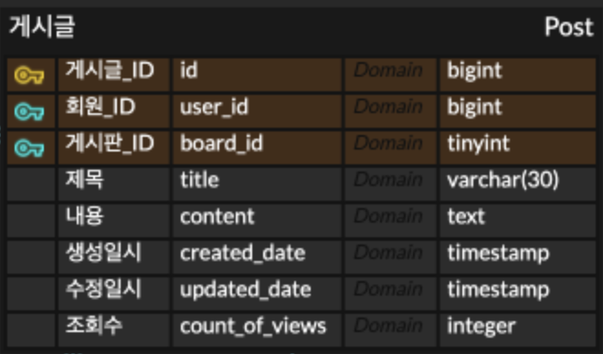
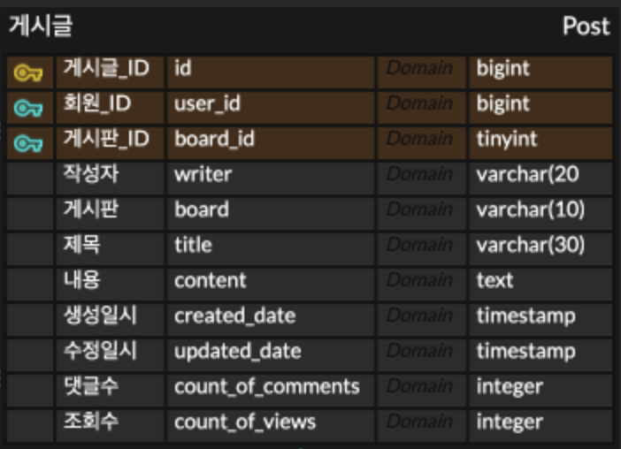
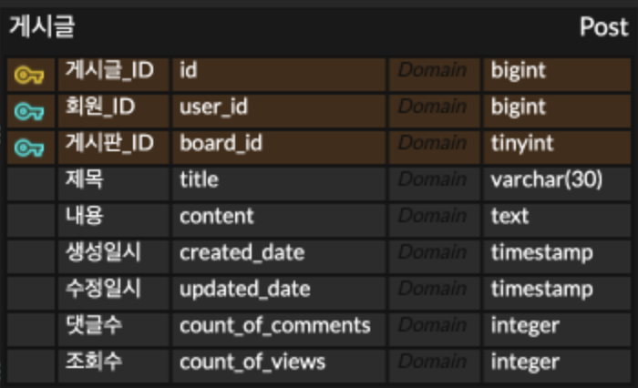

# 정규화와 역정규화

## 문제

카테고리별로 글을 정리하고 상단 네비게이션바에서 게시판을 선택하고 싶어서,
이를 위해 `POST` 테이블의 `CATEGORY` 컬럼을 `BOARD` 테이블로 정규화했다.

그런데 이렇게 하고보니 `POST` 테이블에서 `FK`로 참조하고있는 테이블이 2개이고
글목록에서 댓글 개수까지 참조하려면
`JOIN` 테이블의 수가 `USER`, `COMMENT`, `BOARD` 총 3개가 필요해졌다.

메인화면에서 글 목록을 가져오는데 3개의 테이블을 `JOIN`하고
심지어 `COMMENT`는 집계함수 `COUNT()`까지 사용한다.
또한 쿼리를 작성해보니 너무 복잡하고 길어졌다.

## 분석

1. 정규화는 `JOIN`으로 인하여 성능이 저하된다.
2. `JOIN`이 많아지면 쿼리 유지보수가 힘들다.

## 해결

### 1. 역정규화

먼저 POST 테이블과 관련된 모든 테이블을 역정규화를 해보니
중복이 너무 많이 발생하고 컬럼도 너무 많아졌다.

### 2. 부분 역정규화
USER와 BOARD는 다른 페이지에서도 사용하는 테이블이기 때문에 COMMENT만 역정규화 하기로 결정했다.
COMMENT를 역정규화하기로 결정한 이유는 다음과 같다.

1. `COMMENT`를 가져오는 이유는 메인화면에 `댓글수`를 출력하는 것이 목적인데, 이를 위해 집계함수 `COUNT()`를 사용하기 때문에 성능을 가장 저하시킨다고 생각했다.
2. `COMMENT`는 `COUNT()`를 위해 `GROUP BY`를 사용해야해서 `USER`와 `BOARD` 테이블보다 쿼리를 더 복잡하게 만든다.
3. `COUNT_OF_COMMENTS`에 대한 무결성은 `COMMENT`가 `INSERT`될때마다 검증하면 된다고 생각했다. 

따라서 POST 테이블에 COUNT_OF_COMMENT 컬럼을 추가하여 COMMENT 테이블만 역정규화함.

## 검증

[//]: # (TODO : 테스트케이스 추가 후 작성)

### 정규화/역정규화에 따른 메인화면 성능 테스트
1. 모든 테이블을 정규화하고 `JOIN`하는 쿼리
2. 모든 테이블을 역정규화하고 `SELECT`만 하는 쿼리
3. `COMMENT` 테이블만 정규화한 쿼리

### COMMENT 정규화에 따른 무결성 검증 성능테스트
1. `COMMENT` 테이블에 `INSERT`될 때마다 `POST` 테이블의 `COUNT_OF_COMMENTS` 무결성 검증하는 방법
2. `POST` 테이블에서 `COMMENT` 테이블 `JOIN`하고 `COUNT()`하는 방법

> **[참고자료]**  
> [제 1-2-3 정규화 & 역정규화 기법](https://inpa.tistory.com/entry/DB-%F0%9F%93%9A-%EC%A0%9C-1-2-3-%EC%A0%95%EA%B7%9C%ED%99%94-%EC%97%AD%EC%A0%95%EA%B7%9C%ED%99%94)  
> [정규화와 성능](https://ryeom2.tistory.com/54)